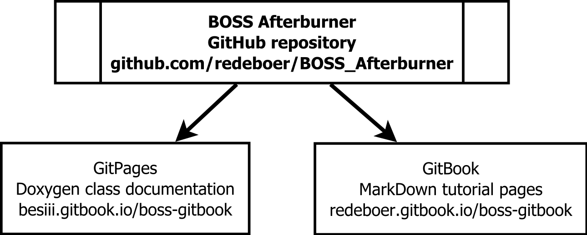

# Main page


**This repository is still under development!**


## The BOSS Afterburner repository

This repository has been set up as an unofficial extension to the BOSS analysis framework of the [BESIII collaboration](http://bes3.ihep.ac.cn), with two related purposes:

1. Serve as an accessible introduction and user guide to **BOSS**.
2. Provide basic tools to analyse and visualise output of **BOSS**.

If you do not have an IHEP networking account, it is therefore better to check out the official [Offline Software page](http://english.ihep.cas.cn/bes/doc/2247.html) of BESIII — this framework can only be of use if you are a collaborator of this experiment and if you have access to the software of this collaboration. You can also have a look at the links in the section [Further reading](appendices/references.md).

The BOSS Afterburner repository consists of three components. There is:

1. [the BOSS GitBook](https://besiii.gitbook.io/boss-gitbook) \(the pages at hand\), which contains tutorial-like pages on both the BOSS Analysis Framework and on the BOSS Afterburner;
2. [the repository itself on GitHub](https://github.com/redeboer/BOSS_Afterburner), containing all the source code, including MarkDown files;
3. [Doxygen documentation of the BOSS Afterburner](https://redeboer.github.io/BOSS_Afterburner/). This page can be consulted for more details about the code in the BOSS Afterburner, but also contains some information of the structure of file output from BOSS.

## Tutorial pages

The documentation of this [GitBook](https://besiii.gitbook.io/boss-gitbook) is intended to provide tutorials for using both the BOSS Analysis Framework and the BOSS Afterburner. If you are not familiar with BOSS, it is best to start looking at that part of the tutorial. This tutorial will help you set up the BOSS environment in your account on the IHEP server \('install BOSS'\), setup up BOSS packages and run them using job options and the `TestRelease` package.



Parts of this tutorial already refer to components of the BOSS Afterburner repository, because it contains example and helper scripts that you might find useful.

If you have been able to create data output, you can analyse your results by designing your own `C++` scripts. Optionally, you can use the code in the BOSS Afterburner as a help. The BOSS Afterburner is described in the second part of this GitBook.



Finally, I am collecting some problems and solutions in the [Tips & Tricks](appendices/tips.md) section. Other additional sections, like references in [Further reading](appendices/references.md), have also been collected into these appendices.

